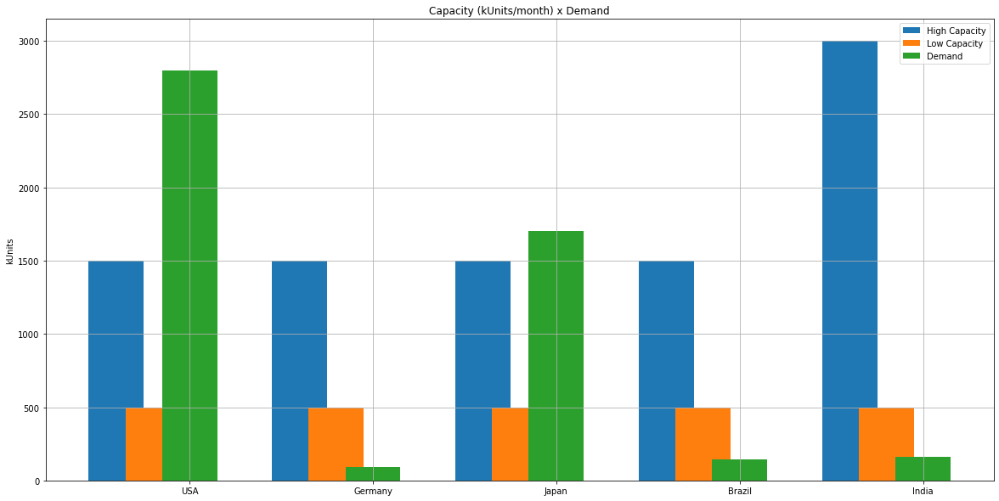
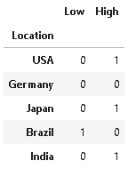

# Supply Chain Optimization

<!---Esses são exemplos. Veja https://shields.io para outras pessoas ou para personalizar este conjunto de escudos. Você pode querer incluir dependências, status do projeto e informações de licença aqui--->

### :speech_balloon: Intro

Based on data such as demand, production capacity, fixed costs and variable costs, it is possible to improve business decision-making based on mathematical calculations to optimize the supply chain. One of the main objectives of a supply chain optimization project is to reduce cost and allocate production capacity so that it can efficiently meet demand. For this, the PulP library was used in conjunction with Pandas to help optimize production at the lowest possible total cost, allocating production capacity in the most profitable way.

### :rocket: Objectives

> - Minimize the total cost considering the high and low capacity levels of the factories.
> - Define how many factories should be built to meet demand efficiently.
> - Assign the capacity of each of the factories that must be built.
> - Return the total cost to meet the demand.

'''
## :chart_with_upwards_trend: Results

> - The number of factories and their capacities were arranged in a dataframe as a result.
> - The result obtained shows the ideal production capacity to meet demand at the lowest possible cost.
> - The total cost of production is displayed.

<!--## :bar_chart: Images-->
<table>
  <tr>
    <td align="center">
      <a href="image-2.png">
         
        
          <b>Demand x Capacity</b>
        
      </a>
    </td>
    <td align="center">
      <a href="image-1.png">
         
        
          <b>Plants allocation</b>
        
      </a>
    </td>
</table>
